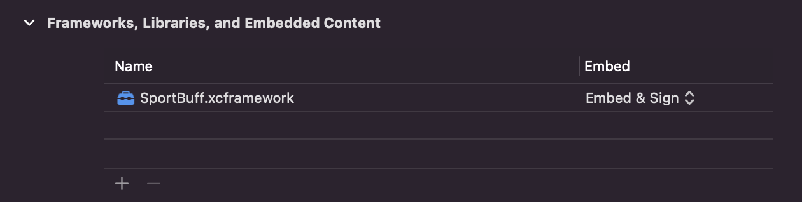

# SportBuff iOS SDK Documentation

This document contains information about the Sport Buff iOS SDK setup, features and configuration options

**Getting Started**

The SDK is available for iOS with support to version 12 and newer as a Cocoa Pod library and as a xcframework. 

<br>
## SDK Integration

### 1. CocoaPods

[CocoaPods](https://cocoapods.org/) is a dependency manager for Cocoa projects. For usage and installation instructions, visit their website. To integrate SportBuff into your Xcode project using CocoaPods, specify it in your Podfile:

````
pod 'SportBuff', '0.0.34.0'
````
<br>

### 2. XCFramework

To integrate the SDK as a xcframework, you will need to follow the following steps:
 	1. Download the SportBuff.xcframework
 	2. Drag & drop SportBuff.xcframework to your project's target "Frameworks, Libraries, and Embedded Content" section under the "General" tab, and make sure that the "Embed & Sign" is selected


<br><br>

## **Using the SDK**

1. Import the SportBuff framework header in your app delegate

   ```swift
   import SportBuff
   ```

2. Authenticate your SDK and user:
   The SDK requires a JWT Token, in order to authenticate. In order to obtain that token, you have two options
   
<br>
#### *Option A*

Authenticate the user using our Rest API, in your own backend and then sign in the user with the following method:

```swift
SportBuff.initialize(userToken: "<UserToken>")
```

##### userToken: 

**Required** The user JWT Token you've received from our Backend API service

*The procedure is explained in the API Documentation section*

<br>
#### *Option B*


Authenticate directly in the application using the SDK Key/Secret pair you did receive from us:

```swift
SportBuff.initialize(sdkKey: "<SDK Key>",
                     sdkSecret: "<SDK Secret>",
                     uuid: "<UUID>",
                     username: "<Username>",
                     firstName: "<First Name>",
                     lastName: "<Last Name>",
                     email: "<Email>",
                     locale: "<Locale>") { userToken in
}
```

##### sdkKey: 

**Required** The SDK key you've received from us

##### sdkSecret:

**Required** The SDK secret you've received from us

##### uuid: 

**Required** A unique identifier for the current user, which will always be the same for this user

##### username: 

***Optional*** The username

##### firstName: 

***Optional*** The user's first name

##### lastName: 

***Optional*** The user's last name

##### email: 

***Optional*** The user's email address

##### locale: 

***Optional*** The user's locale


Returns the user token as String


## Configuring the SDK

Our SDK provides a custom View named ** BuffView**, which is responsible for displaying all UI elements on top of your video view.

Add this View on top of your video view then configure the placement of the elements in the BuffView, by using the Styleable properties of the view:

##### **buffXPosition**

Controls the **horizontal axis alignment** of the Buff Questions and Answers and has the following three options:

- left
- center
- right

------

##### **pointsXPosition**

Controls the **horizontal axis alignment** of the Buff User Points View and has the following three options:

- left
- center
- right

------

##### **pointsYPosition**

Controls the **vertical axis alignment** of the Buff User Points View and has the following three options:

- top
- center
- bottom

------

##### **menuXPosition**

Controls the **horizontal axis alignment** of the Buff Menu Button and has the following three options:

- left
- center
- right

------

##### **menuYPosition**

Controls the **vertical axis alignment** of the Buff Menu Button and has the following three options:

- top
- center
- bottom

------

**menuVisible**

Controls the visibility of the Menu Button (on/off)

------

##### **menuIcon**

**menuIconOff**

Allows you to define a custom Menu Icon Asset when the menu is closed or open

------

##### **buffXOffset**

##### **buffYOffset**

Allows you to define custom margins for the buff's location

------

##### **pointsXOffset** 

##### **pointsYOffset**

Allows you to define custom margins for the User Points location

------

##### **menuXOffset** 

##### **menuYOffset**

Allows you to define custom margins for the Buff Menu Icon location


## Setting up the Stream in the SDK

In order for us to be able to serve the appropriate Buff's for the given stream, we need to receive the Stream information.

This is done by using the following method, when the stream is initialized on your video player:

```swift
let buffView = BuffView()
buffView.startStream(streamId: "<Stream ID>", streamSourceId:"<Stream Source ID>", streamTitle: "<Stream Title>")
```

*In case of a live stream where events are changing on the same stream, you need to use the above function again with the updated stream title and timestamp for the event, each time a new event is starting*

*You can provide either the streamTitle or streamId (or both if you like).*

*However it is recommended using the Stream Identifier approach to avoid any problems with identical stream Titles.*

** streamTitle**

The name of the Stream you are going to be showing to the user

** streamId**

The id of the Stream you are going to be showing to the user as a unique identifier

** streamSourceId **

The source id of the Stream you are going to be showing to the user


**In case of a continuous stream where the events are changing, you need to reuse the above method each time the stream event changes**


## API Documentation

We offer two REST API endpoints that should be used by the CBS (Client's Backend System) in order to authenticate a user and obtain a user JWT Token.

The authentication flow is as follows:

1. You obtain an **SDK Client Token**, using your SDK Key/Secret pair that we provided you with and making a **POST** request on the following endpoint:

   `/v1/auth/client`

```json
Request Body
{
  "key": "string",
  "secret": "string"
}
```

You should receive a JSON payload in the following format with your **SDK Client Token**:

```json
{
  "id": int,
  "token": "string"
}
```


2. You obtain a **User Client Token**, by using your SDK Client Token to authenticate and making a **POST** request on the following endpoint:

`/v1/auth/uuid`

```json
Request Body
{
  "uuid": "128 bit UUID String",
  "email": "string",
  "first_name": "string",
  "last_name": "string",
  "username": "string"
}
```

The **uuid** is the only required parameter. **email, first_name, last_name and username** are *optional parameters*.


You should receive a JSON payload in the following format with the **User JWT Token**:

```json
{
  "id": int,
  "token": "string"
}
```


**The current base URL** is `https://sdk-api-staging.buffup.net/api`

------

#### Example curl requests

```json
curl --location --request POST 'https://sdk-api-staging.buffup.net/api/v1/auth/client' \
--header 'Content-Type: application/json' \
--data-raw '{
	"key": "SDK KEY",
	"secret": "SDK SECRET"
}'
```

```json
curl --location --request POST 'https://sdk-api-staging.buffup.net/api/v1/auth/uuid' \
--header 'Content-Type: application/json' \
--header 'Authorization: Bearer SDK_CLIENT_TOKEN' \
--data-raw '{
	"uuid": "123-456-789-0000"
}'
```

